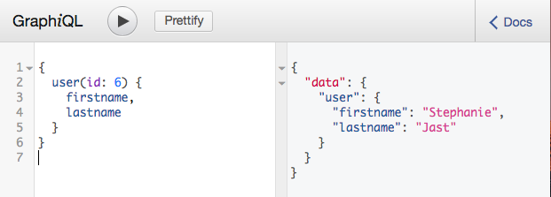
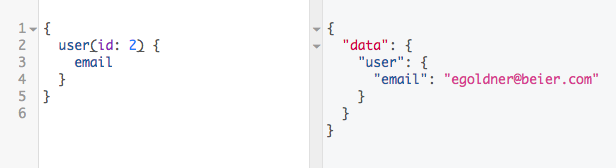
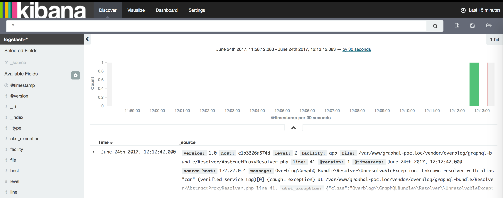

GraphQL-poc
===============

A GraphQL backend Proof of Concept with Symfony 3

# Installation
## With Docker
```
docker-compose up --build
docker-compose exec php composer install
docker-compose exec php bin/console d:d:c
docker-compose exec php bin/console d:s:c
docker-compose exec php bin/console h:d:f:l -b FixtureBundle -n
```

## Classic
```
composer install
bin/console d:d:c
bin/console d:s:c
bin/console h:d:f:l -b FixtureBundle -n
```

# Play
GraphiQL : http://localhost:8080/graphiql

ELK      : http://localhost:8081/





